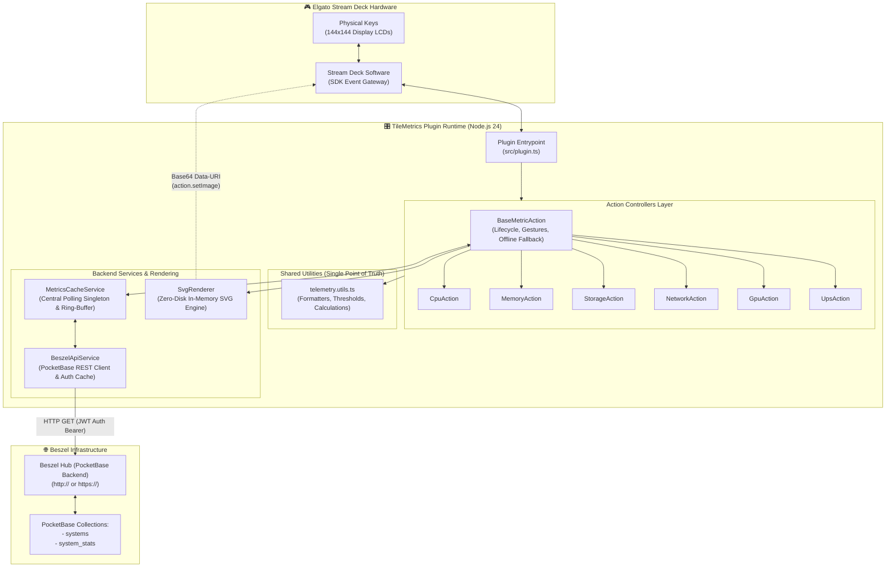
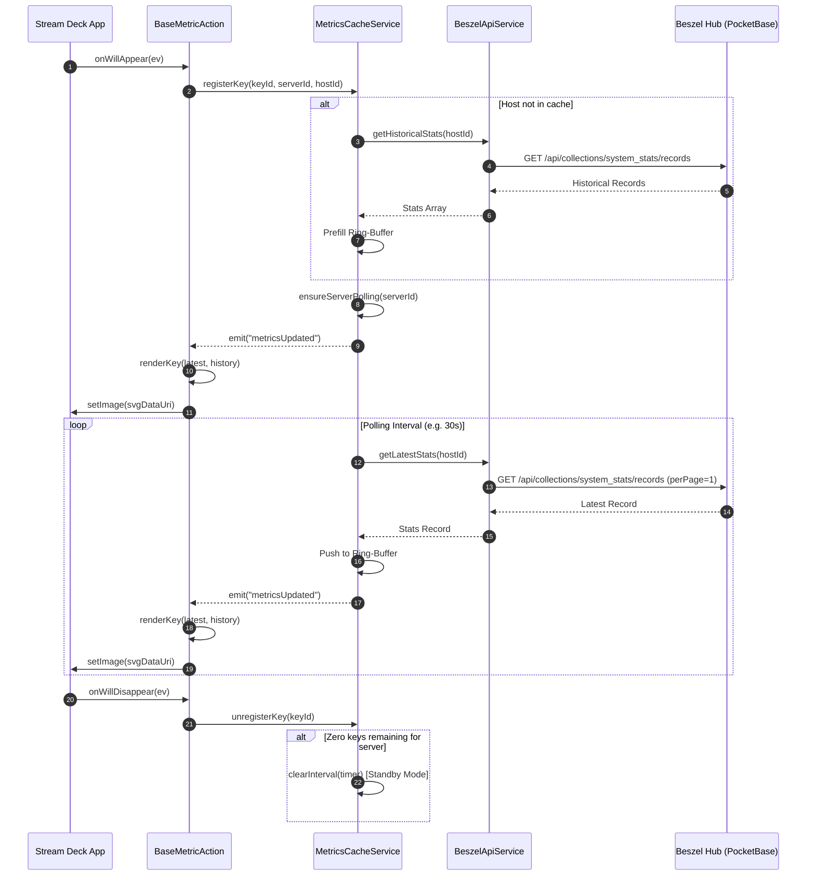

<a id="top"></a>

# System Architecture & Technical Specifications (`docs/architecture.md`)

This document provides a comprehensive technical breakdown of the **TileMetrics (Beszel)** Elgato Stream Deck plugin architecture, component relationships, data flow models, and runtime lifecycles.

---

## 📑 Table of Contents

- [🏛️ 1. High-Level System Architecture](#-1-high-level-system-architecture)
- [🧩 2. Core Architectural Principles](#-2-core-architectural-principles)
- [📁 3. Project Directory Structure](#-3-project-directory-structure)
- [🔌 4. Core Services Layer](#-4-core-services-layer)
    - [BeszelApiService](#beszelapiservice)
    - [MetricsCacheService](#metricscacheservice)
- [🎨 5. In-Memory SVG Rendering Engine (`SvgRenderer`)](#-5-in-memory-svg-rendering-engine-svgrenderer)
- [🕹️ 6. Action Controllers & Lifecycle (`BaseMetricAction`)](#-6-action-controllers--lifecycle-basemetricaction)
- [📐 7. Shared Telemetry Utilities & DRY Architecture (`telemetry.utils.ts`)](#-7-shared-telemetry-utilities--dry-architecture-telemetryutilsts)
- [🔄 8. Lifecycle & Polling Coordination Data Flow](#-8-lifecycle--polling-coordination-data-flow)
- [⚙️ 9. Property Inspector Architecture](#-9-property-inspector-architecture)
- [🔒 10. Security & Read-Only Guarantees](#-10-security--read-only-guarantees)

---

## [🏛️ 1. High-Level System Architecture](#top)

TileMetrics operates as an Elgato Stream Deck plugin running under Node.js 24 using the official `@elgato/streamdeck` SDK. It functions exclusively as a read-only client polling user-specified Beszel hubs via PocketBase REST APIs and rendering dynamic SVG key telemetry.



---

## [🧩 2. Core Architectural Principles](#top)

1. **Single-Root Repository**:
    - Dedicated, self-contained Stream Deck plugin repository without sub-packages or helper background daemons.
2. **Strict Read-Only Operations**:
    - All network traffic consists solely of HTTP `GET` requests against PocketBase collection endpoints and initial authentication queries.
    - The plugin does not perform any record mutations, administrative deletions, or configuration modifications on Beszel instances.
3. **Zero-Disk In-Memory SVG Rendering**:
    - Dynamic key imagery (144×144 px), numerical indicators, labels, status dots, and sparkline area polylines are constructed in memory.
    - Data is delivered directly to the hardware as `data:image/svg+xml;base64,...` data URIs. No temporary image or SVG files are written to the local filesystem.
4. **Reference-Counted Standby Polling**:
    - Scheduled polling intervals run exclusively for active, visible keys on the Stream Deck.
    - When all keys referencing a server or host are hidden or removed, associated timers are destroyed, entering a zero-overhead standby mode.
5. **Decoupled Architecture**:
    - Action classes implement metric calculations and visual thresholds, delegating network operations and polling orchestration to centralized singletons.

---

## [📁 3. Project Directory Structure](#top)

```
tilemetrics/
├── .github/                     # GitHub CI/CD workflows and repository templates
│   ├── ISSUE_TEMPLATE/          # Issue forms for bugs and feature proposals
│   │   ├── bug_report.yml       # Bug report template
│   │   ├── config.yml           # Issue configuration
│   │   └── feature_request.yml  # Feature request template
│   ├── workflows/               # Automated GitHub Action pipelines
│   │   ├── ci.yml               # Lint, build & validation pipeline
│   │   └── release.yml          # Tagged release packaging pipeline
│   ├── dependabot.yml           # Automated dependency update configuration
│   └── pull_request_template.md # PR submission checklist & metadata template
├── assets/                      # Vector graphics and marketplace badges
│   ├── actions/                 # Telemetry action glyphs and fallback key icons
│   │   ├── cpu/                 # CPU processor icons (icon.svg, key.svg)
│   │   ├── gpu/                 # GPU graphics card icons (icon.svg, key.svg)
│   │   ├── memory/              # RAM memory stick icons (icon.svg, key.svg)
│   │   ├── network/             # Network throughput icons (icon.svg, key.svg)
│   │   ├── storage/             # Storage disk icons (icon.svg, key.svg)
│   │   └── ups/                 # UPS / Battery icons (icon.svg, key.svg)
│   ├── category-icon.svg        # Stream Deck action bar category icon (28×28)
│   ├── plugin-icon.png          # Stream Deck marketplace badge (256×256)
│   └── plugin-icon@2x.png       # High-DPI marketplace badge (512×512)
├── bin/                         # Modular transpiled build output (preserveModules: true)
│   ├── actions/                 # Transpiled telemetry action controllers
│   ├── rendering/               # Transpiled SvgRenderer engine
│   ├── services/                # Transpiled backend services (API client, cache singleton)
│   ├── utils/                   # Transpiled telemetry utilities & formatters
│   └── plugin.js                # Lean entry point (~31 lines, loaded by Stream Deck)
├── docs/                        # Architecture, setup and developer documentation
│   ├── ai-disclosure.md         # AI development disclosures & transparency guidelines
│   ├── architecture.md          # Technical specifications, sequence diagrams & lifecycle docs
│   ├── configuration.md         # Multi-server setup, auth & threshold configuration guide
│   ├── development.md           # Local setup, build, packaging and validation guide
│   └── features.md              # Telemetry action matrix and sub-metric reference
├── scripts/                     # Automation, asset generation & packaging scripts
│   ├── generate_assets.ps1      # Generates action SVG vectors and rasterizes PNG badges
│   └── package_plugin.ps1       # Builds, stages, validates and packages .streamDeckPlugin
├── src/                         # TypeScript plugin source code
│   ├── actions/                 # Stream Deck action implementations
│   │   ├── base.action.ts       # Abstract base controller (lifecycle, gestures, renderOffline)
│   │   ├── cpu.action.ts        # CPU usage, load average & package temperature
│   │   ├── gpu.action.ts        # GPU load, VRAM, power draw & temperature
│   │   ├── memory.action.ts     # RAM, swap & ZFS ARC cache
│   │   ├── network.action.ts    # Total throughput, download (RX) & upload (TX)
│   │   ├── storage.action.ts    # Disk space, read/write I/O & pool status
│   │   └── ups.action.ts        # Battery capacity & power state
│   ├── rendering/               # Zero-disk in-memory graphics generation
│   │   └── svg.renderer.ts      # 144×144 SVG engine with sparklines & threshold styling
│   ├── services/                # Core backend services
│   │   ├── beszel-api.service.ts    # PocketBase REST client with auth token caching
│   │   └── metrics-cache.service.ts # Pooled polling singleton with standby & ring-buffer
│   ├── types/                   # TypeScript schemas and data models
│   │   ├── beszel.types.ts      # PocketBase REST payloads & Beszel metrics schemas
│   │   └── settings.types.ts    # Global and action-specific configuration interfaces
│   ├── utils/                   # Shared Single Point of Truth (DRY) helpers
│   │   └── telemetry.utils.ts   # Formatters, threshold evaluators & sparkline scaling
│   ├── index.ts                 # Package re-export entrypoint
│   └── plugin.ts                # Main plugin initialization & action registration
├── ui/                          # Stream Deck Property Inspector (HTML / CSS / JS)
│   ├── css/                     # Property Inspector stylesheets
│   │   └── sdpi.css             # Elgato dark-mode form controls and component styling
│   ├── common.html              # Dynamic Property Inspector for all 6 telemetry actions
│   ├── global-settings.html     # Multi-Server manager & global preferences configuration
│   ├── i18n.js                  # Dynamic client-side localization loader (en.json / de.json)
│   └── streamdeck-client.js     # WebSocket client bridge for Property Inspector events
├── .editorconfig                # Consistent indentation and coding style configuration
├── .gitattributes               # Line-ending normalizations (LF / CRLF)
├── .gitignore                   # Ignored files, dependencies, logs and build artifacts
├── .prettierignore              # Prettier format bypass rules
├── AGENTS.md                    # Technical reference and operational rules for AI agents
├── CODE_OF_CONDUCT.md           # Contributor Covenant Code of Conduct (v2.1)
├── CONTRIBUTING.md               # Contribution guidelines, PR process and coding standards
├── de.json                      # German localization string bundle
├── en.json                      # English localization string bundle
├── eslint.config.js             # Official Elgato ESLint configuration
├── LICENSE                      # MIT License
├── manifest.json                # Stream Deck plugin manifest specification
├── package.json                 # Project dependencies, build scripts and package metadata
├── PRIVACY.md                   # Strict local read-only data privacy policy
├── README.md                    # Primary repository overview, setup guide & feature matrix
├── rollup.config.mjs            # Rollup bundler configuration with preserveModules: true
├── tsconfig.json                # TypeScript compiler configuration (ES2022 / Bundler)
└── version.json                 # Single Source of Truth for 4-digit project version
```

---

## [🔌 4. Core Services Layer](#top)

### BeszelApiService

Located in [`src/services/beszel-api.service.ts`](../src/services/beszel-api.service.ts), this class encapsulates all communication with a specific Beszel hub instance.

- **Authentication Handling**:
    - Authenticates against PocketBase password endpoints in sequence:
        1. `/api/collections/users/auth-with-password`
        2. `/api/collections/_superusers/auth-with-password`
        3. `/api/admins/auth-with-password`
    - Caches acquired JWT tokens in memory.
    - Intercepts HTTP 401 Unauthorized responses to re-authenticate and retry the failed request automatically once.
- **Self-Signed Certificate Support**:
    - Initializes a custom `https.Agent` with `rejectUnauthorized: false` when configured by the user for internal self-signed deployments.
- **REST Endpoints**:
    - `getSystems()`: Queries `/api/collections/systems/records` for active host inventories.
    - `getLatestStats(systemId)`: Queries `/api/collections/system_stats/records` sorted by `-created` with `perPage=1`.
    - `getHistoricalStats(systemId, limit)`: Queries historical stats records for initial sparkline ring-buffer prefilling.

### MetricsCacheService

Located in [`src/services/metrics-cache.service.ts`](../src/services/metrics-cache.service.ts), this class is a central singleton inheriting from Node.js `EventEmitter`.

- **Reference Counting & Lifecycle Registration**:
    - Actions register active instances via `registerKey(actionInstanceId, serverId, hostId, enableHistory, historyPoints)`.
    - When keys disappear, `unregisterKey(actionInstanceId)` checks whether any remaining keys require the target host or server.
    - Polling timers are dynamically started when the first key referencing a server appears, and cleared when the last key referencing that server is destroyed.
- **Chronological Ring-Buffer**:
    - Maintains an in-memory chronological history (up to 60 data points) per monitored host.
    - When new metrics arrive via scheduled poll cycles, records are appended and old data points are evicted (`shift()`).
- **Event Dispatching**:
    - Fires `metricsUpdated(serverId, hostId, latest, history)` events across the application.

---

## [🎨 5. In-Memory SVG Rendering Engine (`SvgRenderer`)](#top)

Located in [`src/rendering/svg.renderer.ts`](../src/rendering/svg.renderer.ts), `SvgRenderer` generates clean 144×144 pixel vector layouts dynamically without invoking external graphic libraries or native canvas bindings.

### Layout Geometry

- **Dimensions**: `144 × 144` viewport with 14px rounded corners (`rx="14"`).
- **Background**: Subtle dark vertical gradient (`#1e293b` to `#0f172a`).
- **Header (Y: 24)**: System or metric title, truncated to 12 characters with ellipsis.
- **Metric Value (Y: 78)**: Large centered numerical readout with tabular numbers and dynamic font scaling:
    - Length ≤ 5: `32px`
    - Length 6–8: `25px`
    - Length > 8: `20px`
- **Sparkline Chart (Y: 32 to 88)**: 128×56 px region rendering history area polygon and stroke polyline.
- **Footer (Y: 126)**: Metric label or sub-metric status text, accompanied by an accent status dot at (X: 20, Y: 122).

### Threshold States & Colors

| State        | Hex Code            | Condition                                            |
| :----------- | :------------------ | :--------------------------------------------------- |
| **Normal**   | `#10b981` (Emerald) | Metric value below warning threshold.                |
| **Warning**  | `#f59e0b` (Amber)   | Metric value exceeds `warnThreshold` (default: 75%). |
| **Critical** | `#ef4444` (Red)     | Metric value exceeds `critThreshold` (default: 90%). |
| **Offline**  | `#64748b` (Slate)   | Host unreachable, inactive, or unconfigured.         |

---

## [🕹️ 6. Action Controllers & Lifecycle (`BaseMetricAction`)](#top)

Located in [`src/actions/base.action.ts`](../src/actions/base.action.ts), `BaseMetricAction` extends `SingletonAction<ActionSettings>`.

### Hardware Event Routing

- **`onWillAppear`**:
    - Registers the key with `MetricsCacheService`.
    - Immediately renders existing cached metrics if available.
- **`onWillDisappear`**:
    - Unregisters the key from `MetricsCacheService`.
    - Clears pending press timers.
- **`onDidReceiveSettings`**:
    - Re-registers with updated server or host identifiers and refreshes display.
- **`onKeyDown` & `onKeyUp`**:
    - Tracks key down timestamp.
    - Duration < 450 ms triggers `onShortPress`: cycles through `getSubMetrics()` array, persists updated `subMetric` in action settings, and renders new state immediately.
    - Duration ≥ 450 ms triggers `onLongPress`: opens host dashboard in browser via `streamDeck.system.openUrl()`.
- **`onSendToPlugin`**:
    - Responds to Property Inspector requests (e.g., retrieving system host lists).

---

## [📐 7. Shared Telemetry Utilities & DRY Architecture (`telemetry.utils.ts`)](#top)

To adhere strictly to the **Single Point of Truth (DRY - Don't Repeat Yourself)** principle and eliminate duplicate calculations across the 6 action classes, shared mathematical and formatting logic is isolated in [`src/utils/telemetry.utils.ts`](../src/utils/telemetry.utils.ts):

| Function | Purpose | Consumers |
| :--- | :--- | :--- |
| `evaluateThreshold(value, warn, crit)` | Computes `"normal"`, `"warning"`, or `"critical"` states for metrics where higher is worse. | CPU, Memory, Storage, GPU |
| `evaluateInvertedThreshold(value, warn, crit)` | Computes states for metrics where lower values represent critical states. | UPS / Battery |
| `formatTemperature(tempCelsius, unit)` | Formats temperature in Celsius or converts to Fahrenheit (`°C` / `°F`). | CPU, GPU |
| `formatByteThroughput(bytesPerSec)` | Scales byte throughput automatically (`B/s`, `KB/s`, `MB/s`, `GB/s`). | Storage I/O |
| `formatNetworkBandwidth(bytesPerSec)` | Formats bitrates in standard telecom notation (`bps`, `Kbps`, `Mbps`, `Gbps`). | Network Telemetry |
| `formatGigabytes(bytesOrGb)` | Converts raw byte values to formatted gigabytes (`15.2G`). | Memory |
| `computeSparklineMax(history, defaultMax)` | Safely determines dynamic upper bounds for trend graphs. | All Actions |
| `BaseMetricAction.renderOffline(action, title)` | Standardized fallback rendering for unconfigured or disconnected keys. | All Actions |

---

## [🔄 8. Lifecycle & Polling Coordination Data Flow](#top)



---

## [⚙️ 9. Property Inspector Architecture](#top)

The Property Inspector uses standard HTML, CSS, and vanilla JavaScript in [`ui/common.html`](../ui/common.html):

- Communicates with the Stream Deck plugin runtime via standard WebSocket messages.
- Dynamically queries available systems from `BeszelApiService` via `getHosts` messages sent to `onSendToPlugin`.
- Auto-saves all input changes to settings storage without manual save buttons.

---

## [🔒 10. Security & Read-Only Guarantees](#top)

- **Network Scope**: Network traffic is strictly limited to the user-configured Beszel endpoints.
- **Credentials Protection**: Passwords and tokens remain within the Stream Deck application's local settings storage.
- **No Inbound Ports**: The plugin does not listen on any open network sockets or host local HTTP/WebSocket servers.
- **Zero Disk Writes**: Key graphics and metrics reside exclusively in memory (RAM).
